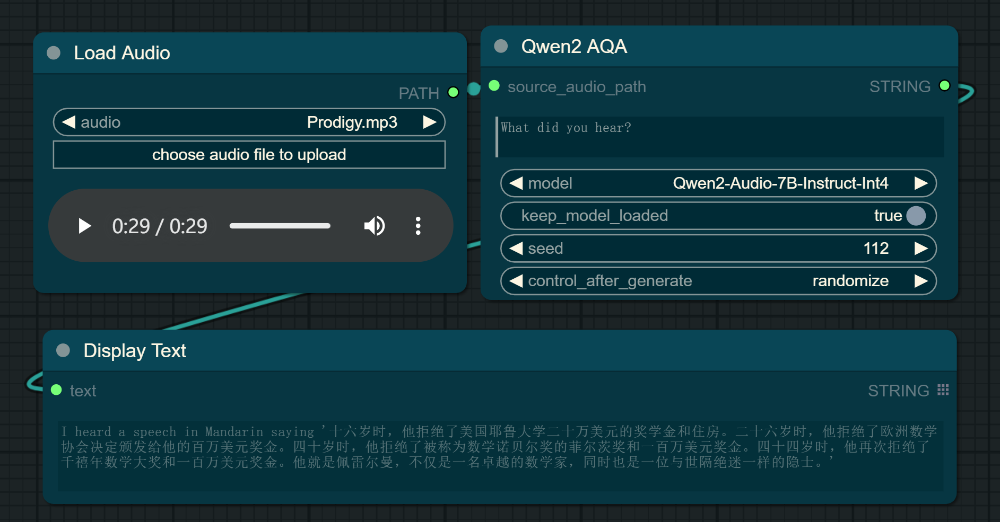

# ComfyUI_Qwen2-Audio-7B-Instruct-Int4

This is an implementation of [Qwen2-Audio-7B-Instruct-Int4](https://github.com/QwenLM/Qwen2-Audio) by [ComfyUI](https://github.com/comfyanonymous/ComfyUI), including support for text-based queries and audio queries to generate captions or responses.

---

## Basic Workflow

- **Text-based Query**: Users can submit textual queries to request information or generate descriptions. For instance, a user might input a description like "What is the meaning of life?"


- **Video Query**: When a user uploads an audio file, the system can analyze the content and generate a detailed caption or a summary of the entire audio. For example, "Tell me what you hear in this audio clip."



## Installation

- Install from [ComfyUI Manager](https://github.com/ltdrdata/ComfyUI-Manager) (search for `Qwen2`)

- Download or git clone this repository into the `ComfyUI\custom_nodes\` directory and run:

```python
pip install -r requirements.txt
```

## Download Models

All the models will be downloaded automatically when running the workflow if they are not found in the `ComfyUI\models\prompt_generator\` directory.
